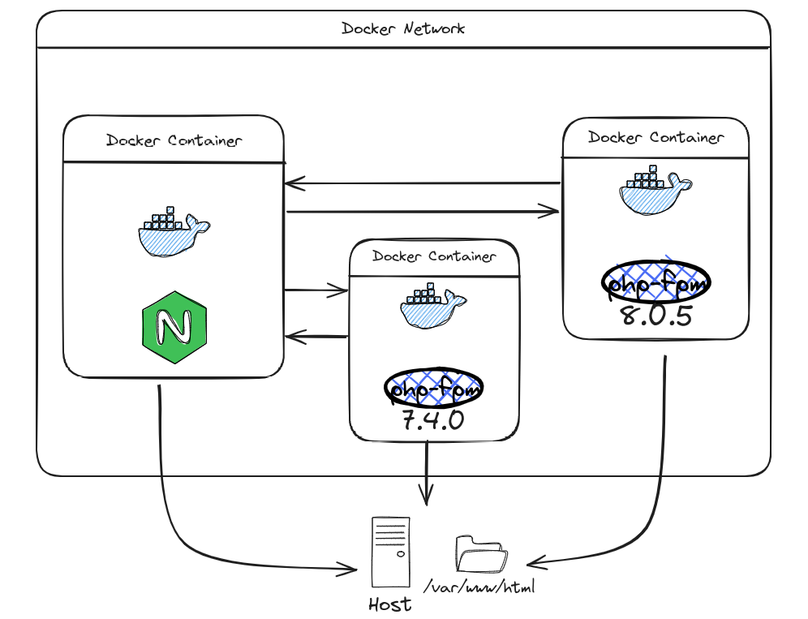

<picture>
  <source media="(prefers-color-scheme: dark)" srcset="./images/nginx-multi-phpfpm-dark.png">
  <source media="(prefers-color-scheme: light)" srcset="./images/nginx-multi-phpfpm-light.png">
  
</picture>

#Dockerizar nginx and multiple version php-fpm

- [x] Configuration nginx php_mapping.conf server request to php-fpm
- [x] Configuration basic interpreter php-fpm FastCGI
- [x] Configuration custom server - domain 
- [x] Shared folder host to stack container

> [!NOTE]
> Do not hesitate to send any questions to my email, I do not know everything but we can learn together with different challenges

@read424 :wink: Great guide to customize development environments with containers! :whale:

Docker — Building an environment with multiple PHP versions on a single Nginx server[^1].

[^1]: [My reference](https://medium.com/@joseclementegarciarodriguez/docker-building-an-environment-with-multiple-php-versions-on-a-single-nginx-server-438108addd28).